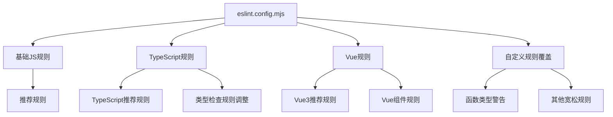

# Vue3+TypeScript ESLint配置方案

## 配置目标
- 为Vue3+TypeScript项目提供适度的代码检查
- 函数类型不定义只警告，不报错
- 保持代码质量的同时不过于严格
- 支持Vue单文件组件(.vue)的检查

## 技术栈分析
根据项目依赖分析：
- Vue 3.5.24
- TypeScript ~5.9.3
- 已安装ESLint相关包：
  - eslint ^9.39.2
  - @typescript-eslint/eslint-plugin ^8.49.0
  - @typescript-eslint/parser ^8.49.0
  - eslint-plugin-vue ^10.6.2
  - vue-eslint-parser ^10.2.0

## 配置方案

### 1. ESLint配置结构

### 2. 规则配置策略

#### 基础规则
- 使用ESLint推荐规则作为基础
- 启用TypeScript推荐规则
- 启用Vue3推荐规则

#### 类型检查规则调整
| 规则 | 级别 | 说明 |
|------|------|------|
| @typescript-eslint/explicit-function-return-type | warn | 函数返回类型不强制，只警告 |
| @typescript-eslint/explicit-module-boundary-types | warn | 模块边界类型不强制，只警告 |
| @typescript-eslint/no-explicit-any | warn | 使用any类型只警告 |
| @typescript-eslint/no-unused-vars | warn | 未使用变量只警告 |

#### Vue特定规则
| 规则 | 级别 | 说明 |
|------|------|------|
| vue/multi-word-component-names | warn | 组件名多单词只警告 |
| vue/no-unused-components | warn | 未使用组件只警告 |
| vue/no-unused-vars | warn | 模板中未使用变量只警告 |

#### 代码风格规则
- 保持基本的代码格式要求
- 允许console.log（开发阶段常用）
- 允许debugger（开发阶段常用）

### 3. 文件覆盖配置
- `.vue`文件使用vue-eslint-parser
- `.ts`和`.tsx`文件使用@typescript-eslint/parser
- 测试文件可以有更宽松的规则

### 4. 配置文件内容

配置将包含以下主要部分：
1. 全局配置和解析器设置
2. 基础JavaScript规则
3. TypeScript特定规则
4. Vue特定规则
5. 自定义规则覆盖

### 5. 集成考虑
- 与现有的Prettier配置兼容
- 与VSCode等编辑器集成
- 支持命令行检查和自动修复

## 预期效果
- 提供基本的代码质量检查
- 函数类型定义问题只显示警告，不阻止开发
- 保持代码一致性
- 不会过于严格影响开发效率
- 支持Vue3组件的完整检查